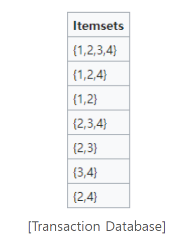
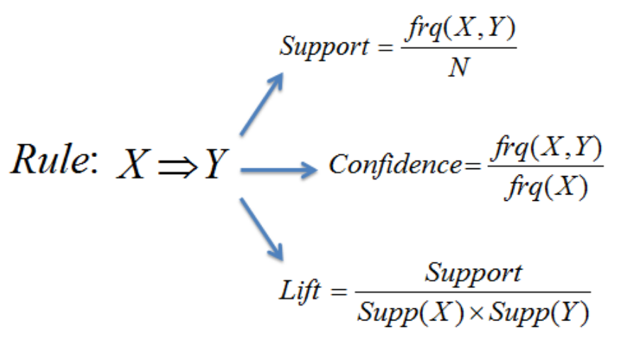

# 중간 산출물

Date: 2024년 10월 25일

# 프로젝트 개발 계획 수립

- 프로젝트 배경 및 목표에 대한 이해 공유
- 고객 페인포인트 식별 재구매 문제 정의
- 팀 구성원 역할 배정 (데이터 분석, 알고리즘 개발, 대시보드 구현 등)
- 프로젝트 일정 및 마일스톤 설정

# 고객 페인포인트

### **고객 페인포인트 식별**

고객이 제품을 재구매하는 과정에서 겪는 불편한 지점(페인포인트)은 다음과 같은 것들이 있을 수 있습니다:

- **제품을 찾기 어려움**: 고객이 이전에 구매한 제품을 다시 찾기가 어려워질 수 있습니다. 이는 제품 목록이 너무 많거나 검색 기능이 직관적이지 않기 때문일 수 있습니다.
- **다양한 선택지에서 혼란**: 너무 많은 유사한 제품이 추천될 때 고객이 재구매할 제품을 선택하는 데 어려움을 느낄 수 있습니다.
- **재구매 알림 부족**: 특정 주기적으로 구매해야 하는 제품에 대해 알림이 없을 경우, 고객이 재구매 시점을 놓치게 될 수 있습니다.
- **재구매 프로세스 복잡성**: 재구매 과정이 번거롭거나 시간이 오래 걸리는 경우, 고객은 재구매를 포기하거나 지연할 수 있습니다.

### 문제 정의

**재구매 문제 정의**

이제 이러한 페인포인트를 바탕으로 재구매 문제를 정의할 수 있습니다:

- **문제 1: 제품 찾기 문제**
    
    고객이 이전에 구매한 제품을 쉽게 찾을 수 없는 문제입니다. 검색 기능이 약하거나 구매 이력에 대한 접근이 직관적이지 않은 경우에 발생합니다.
    
- **문제 2: 적절한 시기에 재구매하지 못하는 문제**
    
    고객이 특정 제품(예: 정기적으로 사용하는 소비재)을 제때 재구매하지 못하는 문제입니다. 이는 재구매 시점을 상기시켜 줄 알림이나 리마인더가 없을 때 발생할 수 있습니다.
    
- **문제 3: 추천 정확도 문제**
    
    재구매 추천 시스템이 고객의 선호도를 반영하지 못해 불필요한 제품이 추천되거나, 고객이 실제로 재구매하고 싶어 하는 제품을 추천하지 못하는 문제입니다.
    
- **문제 4: 재구매 프로세스의 복잡성**
    
    재구매 과정이 직관적이지 않거나 많은 단계를 요구하는 경우, 고객이 중간에 포기하는 문제가 발생할 수 있습니다.
    

# EDA 탐색적 데이터 분석

### 재구매 행태 분석을 위한 탐색적 데이터 분석(EDA) 실행

- 데이터 전처리: 결측치 처리, 이상치 제거, 데이터 형식 변환 등
- 분석에 필요한 주요 변수(피처) 정의 생성 (예: 상품 카테고리, 구매 빈도, 시간대 등)
- 도출된 인사이트 바탕으로 가설 수립 및 검증 (예: 특정 카테고리의 상품 재구매 확률이 높다)

### 주요 변수 정의

- **주문 횟수**
- **주문 간격**
- **카테고리 선호도**
- **평균 장바구니 담기 시간**
- **구매 완료율**
- **상품별 조회 수**
- **구매 상품의 가격대**
- **주문한 플랫폼**
- **이벤트 참여 여부**

### 종합 정리

1. **연관 규칙 학습** - 연관성 있는 다른 카테고리 상품 추천
2. **시계열 분석** - 특정 시간대에 잘 팔리는 상품 추천
3. **이상 탐지와 클러스터링** - 트렌드에 민감한 사용자에게 트렌드 상품 추천
4. **콘텐츠 기반 필터링** - 카테고리 선호도를 반영한 추천

### 추천 알고리즘 기획

1. **상품과 똑같지 않은 카테고리 상품도 관련이 있다면 추천 (ex. 떡볶이 → 김밥)
⇒ 검색페이지**
    
    **[필요 데이터]**
    
    - 상품 메타 정보: 상품ID(`item_id`), 상품명(`bd_item_nm`), 대분류코드(`bd_item_lcls_cd`), 중분류코드(`bd_item_mcls_cd`), 소분류코드(`bd_item_scls_cd`), 세분류코드(`bd_item_dcls_cd`)
    - 사용자 행동 데이터: 유저ID(`user_id`), 상품ID(`item_id`), 행동(`inter` (view, cart, order))
    
    **[활용 방법]**
    
    - 연관된 카테고리 정보와 상품 데이터를 사용하여, 서로 다른 카테고리지만 함께 자주 구매되는 상품을 분석.
        
        예를 들어, 떡볶이를 자주 조회하거나 구매하는 사용자가 김밥도 구매한다면, 떡볶이를 검색한 사용자에게 김밥을 추천하는 방식
        
    - 상품 간의 연관성을 파악하기 위해 **연관 규칙 학습(Association Rule Learning)**, 예를 들어 `Apriori` 알고리즘 사용 가능.
    - `Apriori` 알고리즘
        
        연관 규칙 분석의 대표적인 알고리즘
        
        Apriori 알고리즘이 비교적 구현이 간단하고 성능 또한 높은 수준을 보여주어 자주 활용되고 있음
        
        **Transaction 데이터**가 있어야 하고, **최소지지도(Minimum Support)**를 설정해줘야 한다.
        
        
        
        Transaction 데이터. 최소지지도 3
        
        1. 트랜잭션 데이터베이스를 스캔하면서 1-빈번항목집합을 구한다.
        2. k-빈번항목집합을 대상으로 (k+1)-빈번항목집합을 구한다.
            - Self Join과 Prune을 통해 후보(Candidate)를 구하고,
            - 트랜잭션 데이터베이스를 스캔하면서 최소지지도 조건을 만족하는 후보만 도출한다.
        3. 더 이상 (k+1)-빈번항목집합이 만들어지지 않을 때까지 2번 과정을 반복한다.
        
        이는 Association Rule을 적용하여 **지지도(Support)**, **신뢰도(Confidence)** 그리고 **향상도(Lift)**를 통해 알 수 있다.
        
        
        
        **[참고]**
        
        https://ordo.tistory.com/89
        

1. **특정 시간대에 잘 팔리는 상품은 계속해서 그 시간대에 잘 팔릴 것이다
⇒ 검색창**
    1. 특정 시간대에 구매를 자주 하는 사용자에게 그 시간대에 잘 팔리는 제품을 추천하면 구매할 확률이 높다
    
    **[필요 데이터]**
    
    - 행동 데이터: 이벤트 타임(`event_time`), 행동(`inter`(order)), 상품ID(`item_id`)
    - 추가 변수: 활동 패턴(시간대), 구매빈도
    
    **[활용방법]**
    
    - 특정 시간대에 자주 판매되는 상품을 시간대별로 분석.
        
        예를 들어, 저녁 시간대에 많이 팔리는 상품은 지속적으로 같은 시간대에 추천될 가능성이 높음.
        
    - **시간대별 패턴 분석(Time Series Analysis)**을 활용해, 특정 시간대에 주문량이 높았던 상품을 예측하고 추천.
    - **예측 모델 ⇒** `ARIMA` 모델이나 `LSTM`과 같은 시계열 분석 모델.

1. **트렌드에 민감한 사용자에게는 급상승한 상품을 추천**
    
    ⇒ 와이어프레임 상으로는 급상승한 제품을 전체 사용자가 조회할 수 있도록 하는 식
    
    현재 이 주제는 트렌드에 민감한 사용자에게 ‘알림’을 통해 알려주는 식
    
    **[필요 데이터]**
    
    - 행동 데이터: 주문번호(`order_id`), 상품ID(`item_id`), 이벤트 타임(`event_time`)
    - 추가 변수: 구매빈도, 주문 간격
    
    **[활용 방법]**
    
    - 최근 구매가 급상승한 상품(트렌딩 상품)을 파악하고, 이러한 상품을 구매한 사용자는 다음에도 비슷한 트렌드 상품을 구매할 확률이 높으므로 이를 추천.
    - 구매 패턴의 급격한 변화를 탐지하기 위해 **이상 탐지(Anomaly Detection)** 모델을 활용하거나, 특정 시간대의 판매량 급상승을 **회귀 분석(Regression Analysis)** 로 파악할 수 있음.
    - 트렌드에 민감한 사용자를 파악하는 데는 **클러스터링(Clustering)** 기법을 사용해, 트렌드 상품 구매 비율이 높은 사용자 그룹을 찾아내면 유용함.
    
    - result
    
    ```
                  date        item_id         item_name  event_count    7_day_avg  \
    46493   2024-08-03  xxxxxxxxxxxxx    윌리엄)글렌피딕15년700         1861   424.000000   
    48514   2024-08-03  xxxxxxxxxxxxx  CJ)비비고한우사골곰탕500G           48    13.833333   
    68677   2024-08-04  xxxxxxxxxxxxx    윌리엄)글렌피딕15년700         2851   783.428571   
    74486   2024-08-04  xxxxxxxxxxxxx      롯데)왓따복숭아 23g           14     3.800000   
    75063   2024-08-04  xxxxxxxxxxxxx   사조대림)꼬꼬봉크림치즈30G           49    16.142857   
    ...            ...            ...               ...          ...          ...   
    612457  2024-08-30  xxxxxxxxxxxxx   심플리쿡)민물장어구이425g           41     9.000000   
    612490  2024-08-30  xxxxxxxxxxxxx     카다이프&피스타치오초콜릿        14825  4203.714286   
    612692  2024-08-30  xxxxxxxxxxxxx   아워홈)우거지추어탕_450G          108    25.571429   
    612696  2024-08-30  xxxxxxxxxxxxx   아워홈)콩나물해장국 450G           65    19.714286   
    612940  2024-08-30  xxxxxxxxxxxxx       피넛버터샌드쿠키45G           17     5.142857   
    
            increase_rate  
    46493        4.389151  
    48514        3.469880  
    68677        3.639132  
    74486        3.684211  
    75063        3.035398  
    ...               ...  
    612457       4.555556  
    612490       3.526643  
    612692       4.223464  
    612696       3.297101  
    612940       3.305556  
    
    [2155 rows x 6 columns]
    ```
    

1. **사용자가 자주 구매하는 카테고리를 분석하여 카테고리 선호도를 파악**
    
    **[필요 데이터]**
    
    - 행동 데이터: 사용자ID(`user_id`), 상품ID(`item_id`), 행동(`inter`)
    - 상품 메타 정보: 대분류코드(`bd_item_lcls_cd`), 중분류코드(`bd_item_mcls_cd`), 소분류코드(`bd_item_scls_cd`), 세분류코드(`bd_item_dcls_cd`)
    - 추가 변수: 카테고리 선호도
    
    **[활용 방법]**
    
    - 사용자가 자주 구매한 카테고리를 분석해, 선호도가 높은 카테고리의 상품을 우선 추천.
        
        예를 들어, "중분류"나 "대분류"로 묶어서 해당 카테고리의 제품 추천.
        
    - **콘텐츠 기반 필터링(Content-Based Filtering)**을 사용해 사용자 선호 카테고리의 인기 상품이나 유사한 제품을 추천할 수 있음.
    - 사용자의 구매 패턴을 분석해 카테고리 선호도를 정량화하고, **의사결정 나무(Decision Tree)** 모델을 사용해 해당 카테고리의 추천 우선 순위를 설정할 수 있음.

### 분석 목록

1. 월별 가장 많이 주문된 상품 상위 10가지
2. 총 기간 동안 가장 많이 주문된 상품 상위 10가지
3. 월별 가장 많이 조회된 상품 상위 10가지
4. 총 기간 동안 가장 많이 조회된 상품 상위 10가지
5. 월별 총 고유한 사용자 수
6. 월별 가장 많은 사용자가 있던 시간대 상위 10가지 (1시간 단위)
7. 총 기간 동안 가장 많은 사용자가 있던 시간대 상위 10가지 (1시간 단위)
8. 총 기간 동안 가장 많은 상품이 팔린 시간대 상위 10가지 (1시간 단위)
9. 총 기간 동안 가장 많은 사용자가 있던 시간대 상위 3개에서 가장 많이 팔린 상품 5개
10. 총 기간 평균 판매 수 대비 n시간 동안 50% 이상 판매 증가
